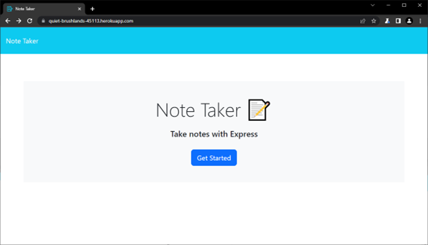
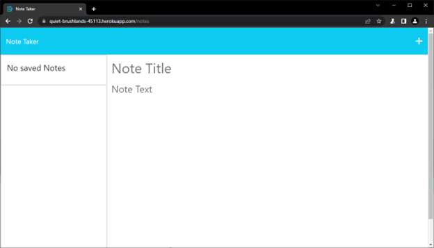
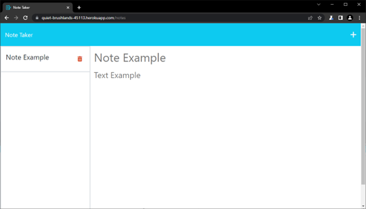

# Note_Taker
11 Challenge

[Heroku app link](https://quiet-brushlands-45113.herokuapp.com/)
## Description
The program is an Express app designed to handle HTTP requests and serve appropriate data based on the request. It employs various modules, each with a specific task. By utilizing different modules, the program achieves a modular and maintainable structure, allowing for easy expansion and customization.

## User Story

```
AS A small business owner
I WANT to be able to write and save notes
SO THAT I can organize my thoughts and keep track of tasks I need to complete
```

## Acceptance Criteria

```
GIVEN a note-taking application
WHEN I open the Note Taker
THEN I am presented with a landing page with a link to a notes page
WHEN I click on the link to the notes page
THEN I am presented with a page with existing notes listed in the left-hand column, plus empty fields to enter a new note title and the note’s text in the right-hand column
WHEN I enter a new note title and the note’s text
THEN a Save icon appears in the navigation at the top of the page
WHEN I click on the Save icon
THEN the new note I have entered is saved and appears in the left-hand column with the other existing notes
WHEN I click on an existing note in the list in the left-hand column
THEN that note appears in the right-hand column
WHEN I click on the Write icon in the navigation at the top of the page
THEN I am presented with empty fields to enter a new note title and the note’s text in the right-hand column
```
## Usage
### Set up project
Install the Express package
```
node install express
```
Install the UUID Generator package
```
node install uuid
```
### Run the app
```
node start
```
## Code
### Overall functionality
**Server.js**

The `server.js` file is the main class of the code. It handles the HTTP requests by utilizing the `express` and `path` modules to create the server and manage the file paths. The application listens for HTTP calls and processes them based on the defined methods, serving the corresponding files or generating appropriate responses for each case. The app is designed to handle two `GET` requests internally, with each function returning an `HTML` file that provides the corresponding web page. Additionally, the app employs a handler that routes requests starting with `/api` to be processed in a separate module.
```js
const express = require('express');
const path = require('path');
const api = require('./lib/routes/notes');
const PORT = process.env.PORT || 3001;
const app = express();
app.use(express.json());
app.use(express.urlencoded({ extended: true }));
app.use('/api', api);
app.use(express.static('lib/public'));
app.get('/', (req, res) =>
    res.sendFile(path.join(__dirname, './lib/public/index.html'))
);
app.get('/notes', (req, res) =>
    res.sendFile(path.join(__dirname, './lib/public/notes.html'))
);
app.listen(PORT, () =>
    console.log(`App listening at http://localhost:${PORT} 🚀`)
);
```
**notes.js**
This module handle every request starting with `/api`. The http request that are being handle in this module are POST, GET and DELETE.

import the necessary packages for the module to work. And makes the app module available to other parts of the codebase.
```js
const express = require('express');
const Note = require('../class/note');
const { v4: uuidv4 } = require('uuid');
const { readAndAppend, readFromFile , deleteFromFile} = require('../helpers/fsUtils');

const app = express();

module.exports = app;
```
**POST**

Handles the `POST` http request. This request recieves an object which contains the new note information, the `uuidv4()` generates an id and then its other values are stored in an object with  `Note` contructor. Which then reads the `db.json` file and appends the new JSON returned from the method `toJSON()` from `Note` class that returns the contained data in a JSON format. Then the promise returns the response status.
```js
app.post('/notes', (req, res) => {
    const { Title, Content} = req.body;
    if (Title && Content) {
        const new_note = new Note (
            uuidv4(),
            Title,
            Content            
        );
        readAndAppend(new_note.toJSON(), './lib/db/db.json');
        const response = {
            status: 'success',
            body: new_note,
        };
        res.json(response);
    } else {
        res.json('Error in posting Note');
    }
});
```
**GET**

The `GET` http request is a read only method. This responds to the request with the content of `db.json` in JSON format.
```js
app.get('/notes', (req, res) =>{
    readFromFile('./lib/db/db.json').then((data) => res.json(JSON.parse(data)));
});
```
**DELETE**

`DELETE` http request sends an id at the end of the URL as a parameter. This parameter is then passed to the `deleteFromFile()` method and removes it from the `db.json` file. 
```js
app.delete('/notes/:id', (req, res) => {
    const noteId = req.params.id;    
    deleteFromFile('./lib/db/db.json',noteId);
    res.json('Note deleted successfully.');
});
```
## ScreenShots





## Video


## App Link
[](https://quiet-brushlands-45113.herokuapp.com/)